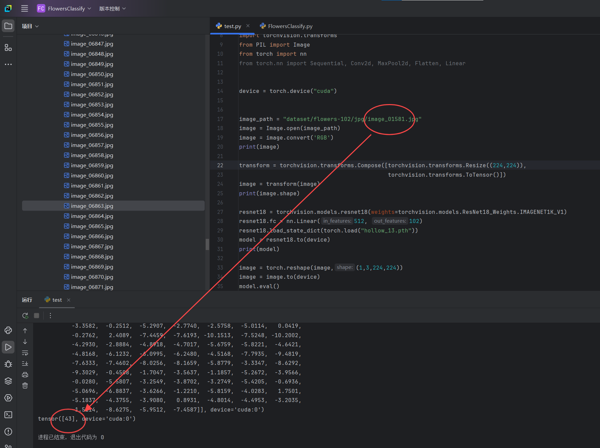
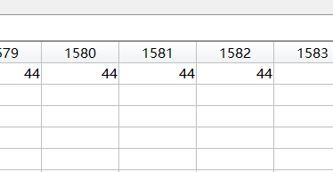

# FlowersClassify
##基于Resnet-18模型实现花卉图像分类 
##使用Pytorch编程库，对102 Catagory Flower Dataset数据集进行训练与测试 
 
第零步：配置pytorch环境，使用pip install命令下载tensorboard（用于绘制损失函数趋势图）  
第一步：创建工程，将FlowerClassify.py与test.py加入工程。  
第二步：通过改变FlowerClassify.py第47行的learning_rate和第52行的epoch可以分别调整训练的速率和轮数。 运行FlowerClassify.py,程序会自动从pytorch下载Flowers102数据集，并储存在“dataset”文件夹中。 
每轮数据训练完后会显示测试正确率，并将该轮训练参数保存为pth文件  
第三步：找到正确率最高的一轮参数对应的pth文件，用它替换test.py中第29行torch.load函数中的文件名。通过改变第17行image_path中路径的文件名可输出改文件图片对应的预测结果，例如测试第1581张图： 
 
由于程序中分类从0开始，所以结果加一，即第44类，通过数据集中的imagelabels.mat可查看每张图片对应的种类，如图：   
第四步：在pycharm的终端中（请确保已经进入设置的anaconda虚拟环境中，如果终端命令行前缀显示PS，请在文件-设置-工具-终端中将Shell路径改为C:\Windows\system32\cmd.exe） 
输入tensorboard --logdir=logs_train,并打开加载出的网络连接localhost:6006,可以获得损失函数和精度的趋势图 
注意：如果运行了多次程序，logs_train文件夹中会有多个event.out.xxxxxxx文件，会导致趋势图重叠或错误，请在运行前提前删掉之前的文件，并关闭tensorboard以清除缓存  
Tips：由于程序较为简单，未使用Dropout等参数，可能会产生过拟合，即在训练次数到达峰值后正确率反而会开始下降，故精度最大的训练轮数并非最后一轮 
此外，趋势图也会一波三折，有兴趣者可以尝试改进
